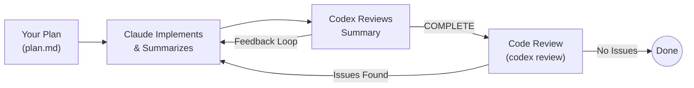

# Humanize

**Current Version: 1.9.0**

> Derived from the [GAAC (GitHub-as-a-Context)](https://github.com/SihaoLiu/gaac) project.

## What is RLCR?

**RLCR** stands for **Ralph-Loop with Codex Review**. It was inspired by the official [ralph-loop](https://github.com/anthropics/claude-code/tree/main/.plugins/ralph-loop) plugin, enhanced with a series of optimizations and independent Codex review capabilities.

The name can also be interpreted as **Reinforcement Learning with Code Review** - reflecting the iterative improvement cycle where AI-generated code is continuously refined through external review feedback.

A Claude Code plugin that provides iterative development with Codex review. Humanize creates a feedback loop where Claude implements your plan while Codex independently reviews the work, ensuring quality through continuous refinement.

## Core Philosophy

**Iteration over Perfection**: Instead of expecting perfect output in one shot, Humanize leverages an iterative feedback loop where:
- Claude implements your plan
- Codex independently reviews progress
- Issues are caught and addressed early
- Work continues until all acceptance criteria are met

This approach provides:
- Independent review preventing blind spots
- Goal tracking to prevent drift
- Quality assurance through iteration
- Complete audit trail of development progress

## Installation

### Option 1: Install from Git Marketplace (Recommended)

Start Claude Code and run the following commands:

```bash
# Add the marketplace
/plugin marketplace add git@github.com:humania-org/humanize.git

# Install the plugin
/plugin install humanize@humania
```

### Option 2: Local Development / Testing

If you have the plugin cloned locally:

```bash
# Start Claude Code with the plugin directory
claude --plugin-dir /path/to/humanize
```

### Prerequisites

- `codex` - OpenAI Codex CLI (for review). Check with `codex --version`.

### Environment Variables

Humanize supports the following environment variables for advanced configuration:

#### HUMANIZE_CODEX_BYPASS_SANDBOX

**WARNING: This is a dangerous option that disables security protections. Use only if you understand the implications.**

- **Purpose**: Controls whether Codex runs with sandbox protection
- **Default**: Not set (uses `--full-auto` with sandbox protection)
- **Values**:
  - `true` or `1`: Bypasses Codex sandbox and approvals (uses `--dangerously-bypass-approvals-and-sandbox`)
  - Any other value or unset: Uses safe mode with sandbox

**When to use this**:
- Linux servers without landlock kernel support (where Codex sandbox fails)
- Automated CI/CD pipelines in trusted environments
- Development environments where you have full control

**When NOT to use this**:
- Public or shared development servers
- When reviewing untrusted code or pull requests
- Production systems
- Any environment where unauthorized system access could cause damage

**Security implications**:
- Codex will have unrestricted access to your filesystem
- Codex can execute arbitrary commands without approval prompts
- Review all code changes carefully when using this mode

**Usage example**:
```bash
# Export before starting Claude Code
export HUMANIZE_CODEX_BYPASS_SANDBOX=true

# Or set for a single session
HUMANIZE_CODEX_BYPASS_SANDBOX=true claude --plugin-dir /path/to/humanize
```

## Usage

### How It Works



The loop has two phases:
1. **Implementation Phase**: Claude works, Codex reviews summaries until COMPLETE
2. **Review Phase**: `codex review --base <branch>` checks code quality with `[P0-9]` severity markers

### Quick Start

1. **Create a plan file** or just write down your thoughts in `<name/you/like/for/draft>.md` and use `/humanize:gen-plan`
   ```bash
   /humanize:gen-plan --input <name/you/like/for/draft.md> --output <docs/my-feature-plan.md>
   ``` 
3. **Run the loop**:
   ```bash
   /humanize:start-rlcr-loop <docs/my-feature-plan.md>
   ```
4. **Monitor progress** in `.humanize/rlcr/<timestamp>/` or you can use the monitor script:
   ```bash
   source ~/.claude/plugins/cache/humania/humanize/<LATEST.VERSION>/scripts/humanize.sh // Add this to your .bashrc or .zshrc
   humanize monitor [rlcr|pr] // Launch this from where you start claude to monitor RLCR loop or PR loop
   ```
5. **Cancel if needed**: `/humanize:cancel-rlcr-loop`

### Commands

| Command | Purpose |
|---------|---------|
| `/start-rlcr-loop <plan.md>` | Start iterative development with Codex review |
| `/cancel-rlcr-loop` | Cancel active loop |
| `/gen-plan --input <draft.md> --output <plan.md>` | Generate structured plan from draft |
| `/start-pr-loop --claude\|--codex` | Start PR review loop with bot monitoring |
| `/cancel-pr-loop` | Cancel active PR loop |

### Command Options

#### start-rlcr-loop

```
/humanize:start-rlcr-loop [path/to/plan.md | --plan-file path/to/plan.md] [OPTIONS]

OPTIONS:
  --plan-file <path>     Explicit plan file path (alternative to positional arg)
  --max <N>              Maximum iterations before auto-stop (default: 42)
  --codex-model <MODEL:EFFORT>
                         Codex model and reasoning effort (default: gpt-5.3-codex:xhigh)
  --codex-timeout <SECONDS>
                         Timeout for each Codex review in seconds (default: 5400)
  --track-plan-file      Indicate plan file should be tracked in git (must be clean)
  --push-every-round     Require git push after each round (default: commits stay local)
  --base-branch <BRANCH> Base branch for code review phase (default: auto-detect)
                         Auto-detection priority: remote default > main > master
  --full-review-round <N>
                         Interval for Full Alignment Check rounds (default: 5, min: 2)
  --skip-impl            Skip implementation phase, go directly to code review
                         Plan file is optional when using this flag
  -h, --help             Show help message
```

#### gen-plan

```
/humanize:gen-plan --input <path/to/draft.md> --output <path/to/plan.md>

OPTIONS:
  --input   Path to the input draft file (required)
  --output  Path to the output plan file (required)

The gen-plan command transforms rough draft documents into structured implementation plans.

Workflow:
1. Validates input/output paths
2. Checks if draft is relevant to the repository
3. Analyzes draft for clarity, consistency, completeness, and functionality
4. Engages user to resolve any issues found
5. Generates a structured plan.md with AC-X acceptance criteria
```

#### start-pr-loop

```
/humanize:start-pr-loop --claude|--codex [OPTIONS]

BOT FLAGS (at least one required):
  --claude   Monitor reviews from claude[bot] (trigger with @claude)
  --codex    Monitor reviews from chatgpt-codex-connector[bot] (trigger with @codex)

OPTIONS:
  --max <N>              Maximum iterations before auto-stop (default: 42)
  --codex-model <MODEL:EFFORT>
                         Codex model and reasoning effort (default: gpt-5.2-codex:medium)
  --codex-timeout <SECONDS>
                         Timeout for each Codex review in seconds (default: 900)
  -h, --help             Show help message
```

The PR loop automates the process of handling GitHub PR reviews from remote bots:

1. Detects the PR associated with the current branch
2. Fetches review comments from the specified bot(s)
3. Claude analyzes and fixes issues identified by the bot(s)
4. Pushes changes and triggers re-review by commenting @bot
5. Stop Hook polls for new bot reviews (every 30s, 15min timeout per bot)
6. Local Codex validates if remote concerns are approved or have issues
7. Loop continues until all bots approve or max iterations reached

**Prerequisites:**
- GitHub CLI (`gh`) must be installed and authenticated
- Codex CLI must be installed
- Current branch must have an associated open PR

**Monitoring:**
```bash
humanize monitor pr
```

## License

MIT

## Credits

- Claude Code: [Anthropic](https://github.com/anthropics/claude-code)
