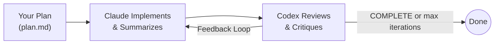

# Humanize

**Current Version: 1.1.2**

> Derived from the [GAAC (GitHub-as-a-Context)](https://github.com/SihaoLiu/gaac) project.

## What is RLCR?

**RLCR** stands for **Ralph-Loop with Codex Review**. It was inspired by the official [ralph-loop](https://github.com/anthropics/claude-code/tree/main/.plugins/ralph-loop) plugin, enhanced with a series of optimizations and independent Codex review capabilities.

The name can also be interpreted as **Reinforcement Learning with Code Review** - reflecting the iterative improvement cycle where AI-generated code is continuously refined through external review feedback.

A Claude Code plugin that provides iterative development with Codex review. Humanize creates a feedback loop where Claude implements your plan while Codex independently reviews the work, ensuring quality through continuous refinement.

## Core Philosophy

**Iteration over Perfection**: Instead of expecting perfect output in one shot, Humanize leverages an iterative feedback loop where:
- Claude implements your plan
- Codex independently reviews progress
- Issues are caught and addressed early
- Work continues until all acceptance criteria are met

This approach provides:
- Independent review preventing blind spots
- Goal tracking to prevent drift
- Quality assurance through iteration
- Complete audit trail of development progress

## Quick Start: Iterative Development with Codex Review

### How It Works



### Step 1: Create Your Plan

Use Claude's plan mode to design your implementation. Save the plan to a markdown file:

```bash
# In Claude Code, enter plan mode and describe your task
# Claude will create a detailed plan
# Save the plan to a file, e.g., docs/my-feature-plan.md
```

Your plan file should contain:
- Clear description of what to implement
- Acceptance criteria
- Technical approach (optional but helpful)
- At least 5 lines of content

### Step 2: Run the Loop

```bash
# Basic usage - runs up to 42 iterations
/humanize:start-rlcr-loop docs/my-feature-plan.md

# Limit iterations
/humanize:start-rlcr-loop docs/my-feature-plan.md --max 10

# Custom Codex model
/humanize:start-rlcr-loop plan.md --codex-model gpt-5.2-codex:high

# Custom timeout (2 hours)
/humanize:start-rlcr-loop plan.md --codex-timeout 7200
```

### Step 3: Monitor Progress

All iteration artifacts are saved in `.humanize-loop.local/<timestamp>/`:

```bash
# View current round
cat .humanize-loop.local/*/state.md

# View Claude's latest summary
cat .humanize-loop.local/*/round-*-summary.md | tail -50

# View Codex's review feedback
cat .humanize-loop.local/*/round-*-review-result.md | tail -50
```

**Real-time Monitoring Dashboard** (Recommended):

First, source the Humanize shell utilities in your `.bashrc` or `.zshrc`:

```bash
# Auto-discover Humanize plugin location from humania marketplace
HUMANIZE_PLUGIN_ROOT=$(find ~/.claude/plugins/marketplaces -type d -name "humania" 2>/dev/null | head -1)
if [[ -n "$HUMANIZE_PLUGIN_ROOT" && -f "$HUMANIZE_PLUGIN_ROOT/scripts/humanize.sh" ]]; then
    source "$HUMANIZE_PLUGIN_ROOT/scripts/humanize.sh"
fi
```

Then run the monitor in your project directory:

```bash
humanize monitor rlcr-loop
```

This provides a real-time dashboard showing:
- Session info and round progress
- Progress summary (ACs, active/completed tasks, issues)
- Git status with file changes and line diffs
- Goal summary, plan file path, and live log output

### Step 4: Pause, Resume, or Cancel

**The loop is fully interruptible** - you can exit Claude Code at any time and resume later:

- **Loop state**: Controlled solely by the presence of `.humanize-loop.local/*/state.md`
- **Resume**: Simply restart Claude Code in the same directory - the loop continues automatically
- **Cancel**: Remove the state file to stop the loop permanently

```bash
# Cancel the active loop
/humanize:cancel-rlcr-loop

# Or manually remove state file
rm .humanize-loop.local/*/state.md
```

The loop directory with all summaries and review results is preserved for reference.

## Goal Tracker System

Humanize uses a **Goal Tracker** to prevent goal drift across iterations:

### Structure
- **IMMUTABLE SECTION**: Ultimate Goal and Acceptance Criteria (set in Round 0, never changed)
- **MUTABLE SECTION**: Active Tasks, Completed Items, Deferred Items, Plan Evolution Log

### Key Features
1. **Acceptance Criteria**: Each task maps to a specific AC - nothing can be "forgotten"
2. **Plan Evolution Log**: If you discover the plan needs changes, document the change with justification
3. **Explicit Deferrals**: Deferred tasks require strong justification and impact analysis
4. **Full Alignment Checks**: At rounds 4, 9, 14, etc. (after every 4 rounds of work), Codex conducts a comprehensive goal alignment audit

### Circuit Breaker

During Full Alignment Checks, Codex can detect development stagnation and trigger a circuit breaker:
- Same issues appearing repeatedly across multiple rounds
- No meaningful progress on Acceptance Criteria
- Circular discussions without resolution

If stagnation is detected, Codex outputs "STOP" to terminate the loop and prevent wasted iterations.

## Installation

### Option 1: Install from Git Marketplace (Recommended)

Start Claude Code and run the following commands:

```bash
# Add the marketplace
/plugin marketplace add git@github.com:humania-org/humanize.git

# Install the plugin
/plugin install humanize@humania
```

### Option 2: Local Development / Testing

If you have the plugin cloned locally:

```bash
# Start Claude Code with the plugin directory
claude --plugin-dir /path/to/humanize
```

### Verify Installation

Run `/plugin` in Claude Code and check the **Installed** tab to confirm the plugin is active.

## Commands

| Command | Purpose |
|---------|---------|
| `/start-rlcr-loop <plan.md>` | Start iterative development with Codex review |
| `/cancel-rlcr-loop` | Cancel active loop |

### Command Options

```
/humanize:start-rlcr-loop <path/to/plan.md> [OPTIONS]

OPTIONS:
  --max <N>              Maximum iterations before auto-stop (default: 42)
  --codex-model <MODEL:EFFORT>
                         Codex model and reasoning effort (default: gpt-5.2-codex:high)
  --codex-timeout <SECONDS>
                         Timeout for each Codex review in seconds (default: 5400)
  --push-every-round     Require git push after each round (default: commits stay local)
  -h, --help             Show help message
```

## Prerequisites

Required tools:
- `codex` - OpenAI Codex CLI (for review)

Check if Codex is available:
```bash
codex --version
```

## Directory Structure

```
humanize/
├── .claude-plugin/
│   └── plugin.json          # Plugin manifest
├── .claude/
│   └── CLAUDE.md            # Project rules
├── commands/                 # Slash commands
│   ├── start-rlcr-loop.md
│   └── cancel-rlcr-loop.md
├── hooks/                    # Lifecycle hooks
│   ├── hooks.json
│   ├── loop-codex-stop-hook.sh
│   ├── loop-write-validator.sh
│   ├── loop-edit-validator.sh
│   ├── loop-read-validator.sh
│   ├── loop-bash-validator.sh
│   ├── check-todos-from-transcript.py
│   └── lib/
│       └── loop-common.sh
├── scripts/                  # Setup scripts
│   ├── setup-rlcr-loop.sh
│   ├── portable-timeout.sh
│   └── humanize.sh           # Shell utilities (monitor command)
├── .gitignore
└── README.md
```

## State Directory Structure

When loop is active, creates: `.humanize-loop.local/<TIMESTAMP>/`

**Files Created**:
- `state.md` - Current round, config (YAML frontmatter)
- `goal-tracker.md` - Immutable (goals/AC) + Mutable (active tasks, deferred, etc.)
- `round-N-prompt.md` - Instructions FROM Codex TO Claude
- `round-N-summary.md` - Work summary written BY Claude
- `round-N-review-prompt.md` - Prompt sent to Codex
- `round-N-review-result.md` - Codex's review output

**Cache Directory** (not in project):
- `$HOME/.cache/humanize/<sanitized-project-path>/<timestamp>/`
  - `round-N-codex-run.cmd` - Command invoked
  - `round-N-codex-run.out` - Codex stdout
  - `round-N-codex-run.log` - Codex stderr

## Design Principles

1. **Iteration over Perfection**: Use review loops to refine work
2. **Independent Review**: Codex provides unbiased feedback
3. **Goal Tracking**: Prevent drift with immutable acceptance criteria
4. **Explicit Deferrals**: Every deferred task requires justification
5. **Circuit Breaker**: Detect and stop stagnating development

## License

MIT

## Credits

- Claude Code: [Anthropic](https://github.com/anthropics/claude-code)
