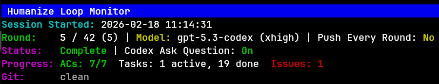

# Humanize

**Current Version: 1.15.2**

> Derived from the [GAAC (GitHub-as-a-Context)](https://github.com/SihaoLiu/gaac) project.

A Claude Code plugin that provides iterative development with independent AI review. Build with confidence through continuous feedback loops.

## What is RLCR?

**RLCR** stands for **Ralph-Loop with Codex Review**, inspired by the official ralph-loop plugin and enhanced with independent Codex review. The name also reads as **Reinforcement Learning with Code Review** -- reflecting the iterative cycle where AI-generated code is continuously refined through external review feedback.

## Core Concepts

- **Iteration over Perfection** -- Instead of expecting perfect output in one shot, Humanize leverages continuous feedback loops where issues are caught early and refined incrementally.
- **One Build + One Review** -- Claude implements, Codex independently reviews. No blind spots.
- **Ralph Loop with Swarm Mode** -- Iterative refinement continues until all acceptance criteria are met. Optionally parallelize with Agent Teams.

## How It Works

<p align="center">
  
</p>

The loop has two phases: **Implementation** (Claude works, Codex reviews summaries) and **Code Review** (Codex checks code quality with severity markers). Issues feed back into implementation until resolved.

## Install

```bash
# Add humania marketplace
/plugin marketplace add humania-org/humanize
# If you want to use development branch for experimental features
/plugin marketplace add humania-org/humanize#dev
# Then install humanize plugin
/plugin install humanize@humania
```

Requires [codex CLI](https://github.com/openai/codex) for review. See the full [Installation Guide](docs/install-for-claude.md) for prerequisites and alternative setup options.

## Quick Start

1. **Generate a plan** from your draft:
   ```bash
   /humanize:gen-plan --input draft.md --output docs/plan.md
   ```

2. **Run the loop**:
   ```bash
   /humanize:start-rlcr-loop docs/plan.md
   ```

3. **Monitor progress**:
   ```bash
   source <path/to/humanize>/scripts/humanize.sh
   humanize monitor rlcr
   ```

## Config System

Humanize now uses a shared config hierarchy instead of scattering defaults across scripts.

Priority is:
1. `config/default_config.json`
2. `~/.config/humanize/config.json`
3. `.humanize/config.json`
4. CLI flags for commands that expose overrides

This keeps RLCR, PR loop, and `ask-codex` aligned on the same Codex defaults, while still letting each project pin its own behavior. The current config surface covers shared review settings such as `codex_model` and `codex_effort`, plus workflow toggles like `bitlesson_model`, `agent_teams`, and plan-generation preferences.

## BitLesson System

Humanize also includes a BitLesson system, which is the repository's Bitter Lesson-style knowledge capture workflow.

Each project keeps a local knowledge base at `.humanize/bitlesson.md`. The RLCR setup initializes that file from a strict template when it is missing. During each round, the loop reads the knowledge base, runs a selector for every task or sub-task, and requires the round summary to include a `## BitLesson Delta` section describing whether a reusable lesson was added, updated, or intentionally left unchanged.

The goal is to turn repeated failure-and-fix cycles into explicit project memory instead of rediscovering the same operational lessons every round.

## Monitor Dashboard

<p align="center">
  
</p>

## Documentation

- [Usage Guide](docs/usage.md) -- Commands, options, environment variables
- [Install for Claude Code](docs/install-for-claude.md) -- Full installation instructions
- [Install for Codex](docs/install-for-codex.md) -- Codex skill runtime setup
- [Install for Kimi](docs/install-for-kimi.md) -- Kimi CLI skill setup

## License

MIT
